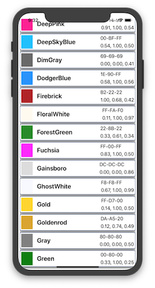

# ColorBlocks

[Xamarin.Forms docs](https://docs.microsoft.com/xamarin/xamarin-forms/) / [eBook](https://docs.microsoft.com/xamarin/xamarin-forms/creating-mobile-apps-xamarin-forms/) / [Related samples](https://docs.microsoft.com/samples/browse/?term=Xamarin.Forms%20Book)

Simple Xamarin.Forms application for Android and iOS, written in F#. The app renders blocks of color:



```fsharp
let vertStack = StackLayout(HorizontalOptions = LayoutOptions.End)
vertStack.Children.Add(Label(Text = String.Format("{0:X2}-{1:X2}-{2:X2}",
                                                    int (255.0 * color.R),
                                                    int (255.0 * color.G),
                                                    int (255.0 * color.B)),
                                VerticalOptions = LayoutOptions.CenterAndExpand,
                                IsVisible = (color <> Color.Default)))
vertStack.Children.Add(Label(Text = String.Format("{0:F2}-{1:F2}-{2:F2}",
                                                    color.Hue,
                                                    color.Saturation,
                                                    color.Luminosity),
                                VerticalOptions = LayoutOptions.CenterAndExpand,
                                IsVisible = (color <> Color.Default)))
horzStack.Children.Add(vertStack)
```

## Prerequisites

- [Visual Studio](https://visualstudio.microsoft.com/) on Mac or Windows.
  - _Mobile Development with .NET (Xamarin)_ workload installed.
  - F\#
- To test and deploy to iOS devices:  
  - Mac computer with the latest version of macOS.
  - Latest version of [Xcode](https://developer.apple.com/xcode/) from Apple on the Mac.
  - If you're using Windows, the Mac should be available on the network.

## Running the sample

1. Open the solution file (**.sln**) in Visual Studio.
1. Use the **Run** button or menu to start the app.
